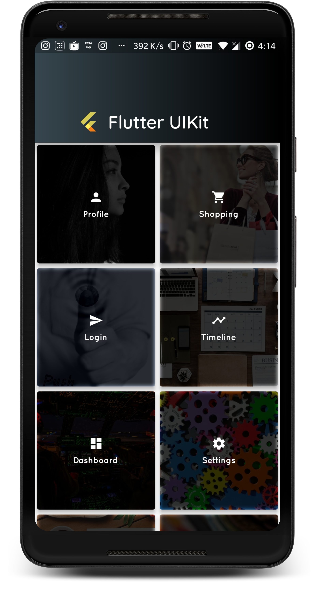
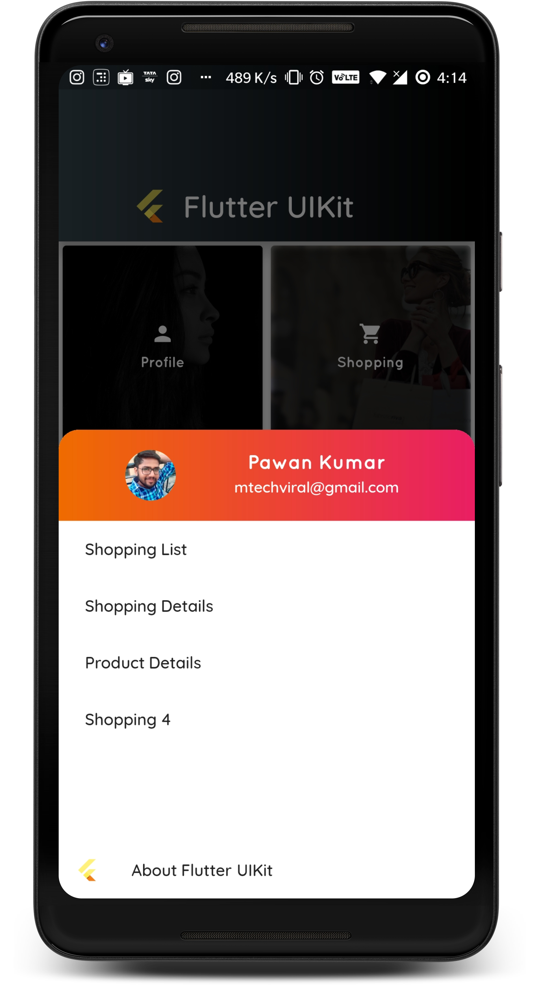
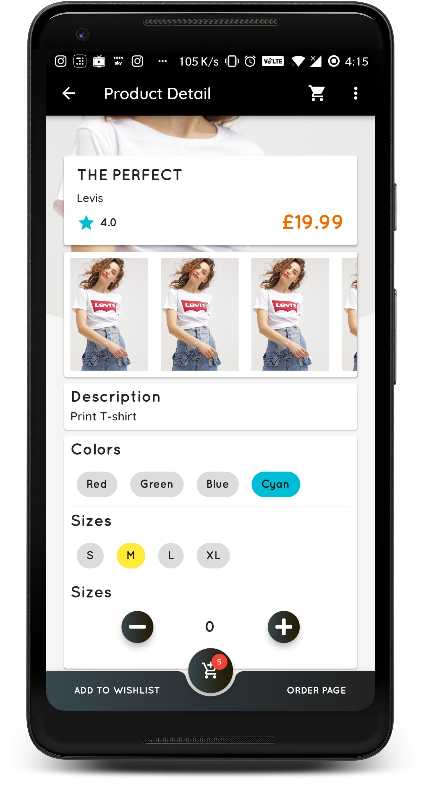
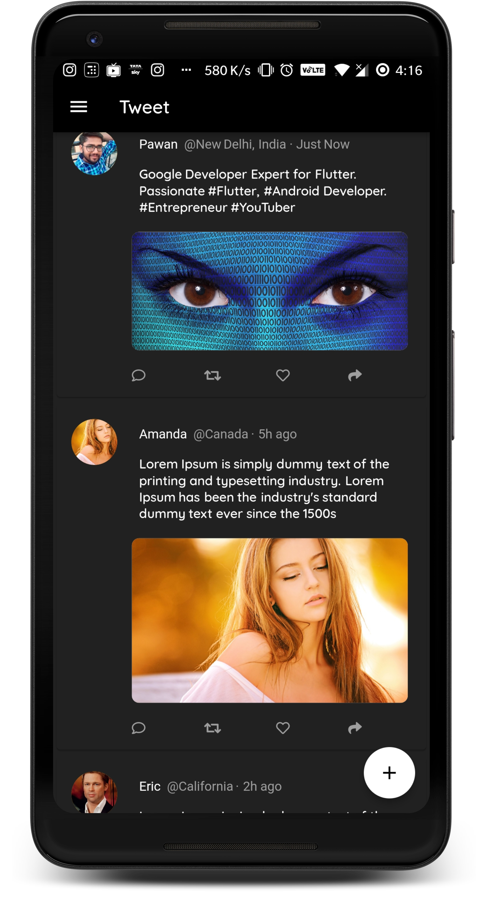
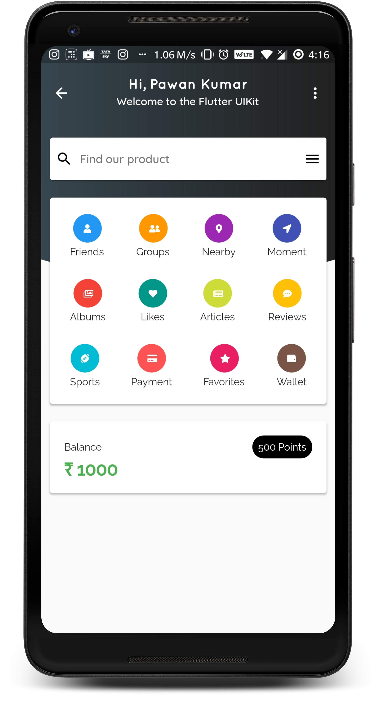
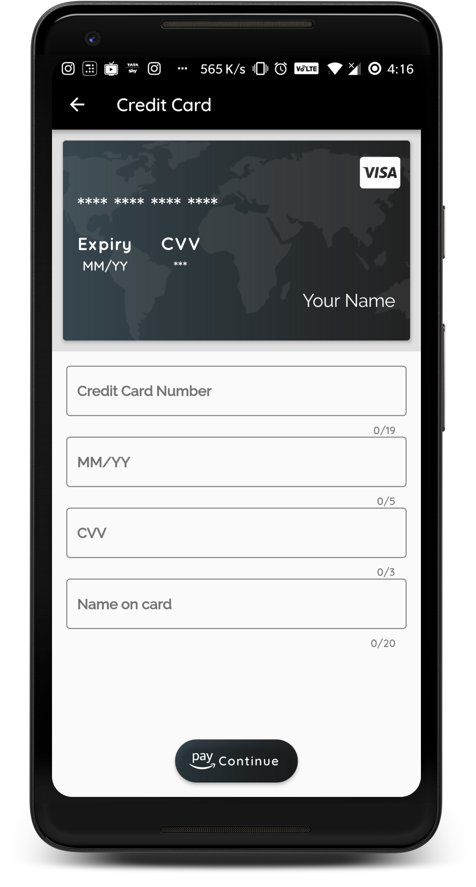
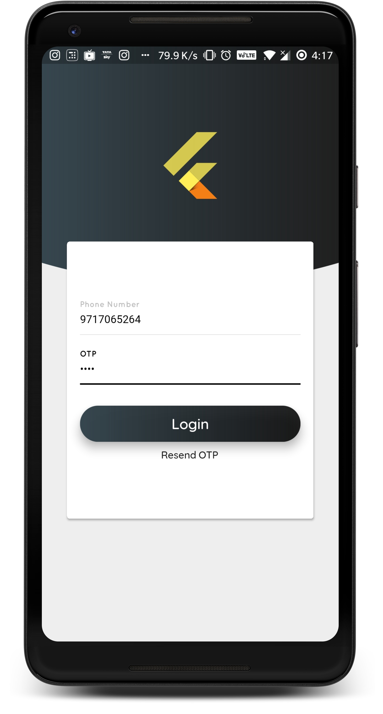
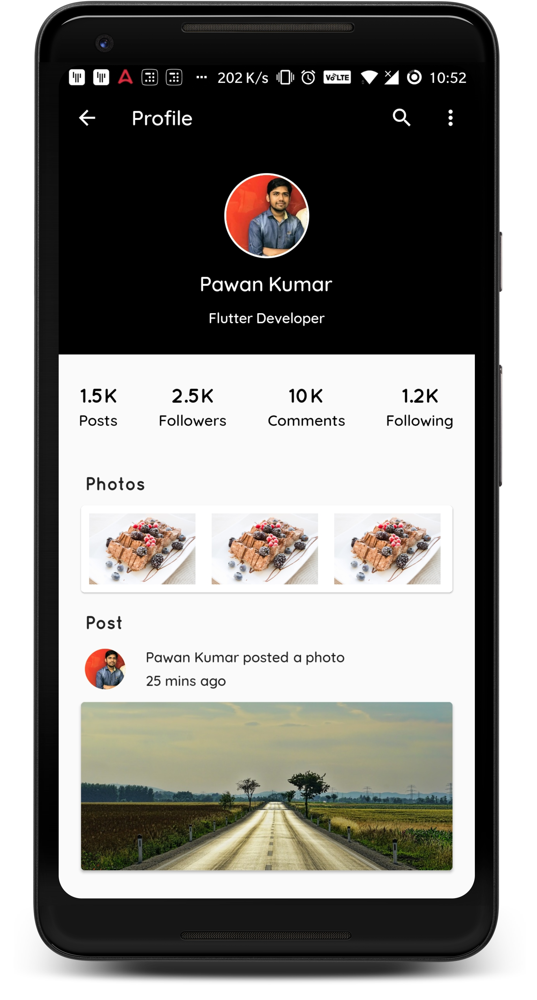
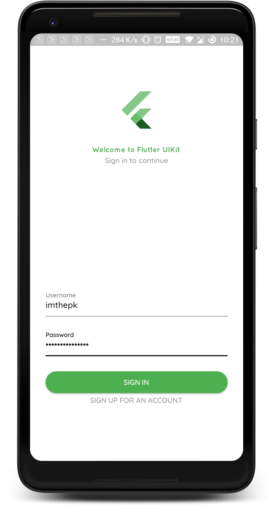
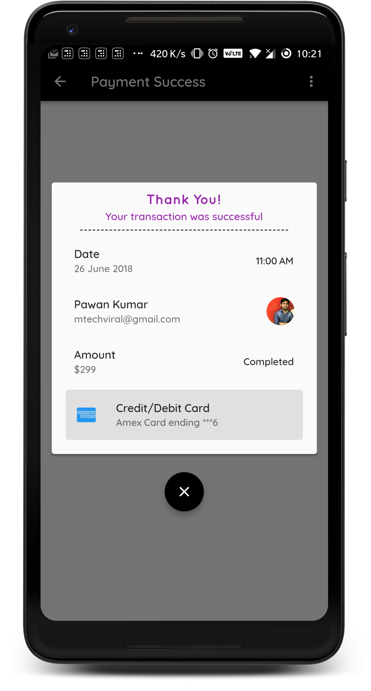

# Flutter UIKit

<a href='https://play.google.com/store/apps/details?id=com.mtechviral.flutteruikit&pcampaignid=MKT-Other-global-all-co-prtnr-py-PartBadge-Mar2515-1'></a>

The goal of this project is to provide an ultimate collection of real world app's UIs.
While I built Flutter UIKit for my own needs, it is also intented to showcase good app structure and a clean, well-organized Flutter codebase.

The source code is **100% Dart**, and everything resides in the [/lib](https://github.com/iampawan/Flutter-UI-Kit/tree/master/lib) folder.

This project will try to **showcase only the best, most popular and well-designed templates** that you will actually need and find useful rather than overwhelming you with a plethora of low-quality ones.

Happy learning. :+1:

### Show some :heart: and star the repo to support the project

[](https://github.com/iampawan/Flutter-UI-Kit) [](https://github.com/iampawan/Flutter-UI-Kit/fork) [](https://github.com/iampawan/Flutter-UI-Kit) [](https://github.com/iampawan/Flutter-UI-Kit)
[](https://twitter.com/imthepk)

[](https://opensource.org/licenses/Apache-2.0)
[](https://github.com/iampawan/Flutter-UI-Kit/blob/master/licence.txt)

## YouTube Channel

[MTechViral](https://www.youtube.com/c/MTechViral)

## Facebook Group

[Let's Flutter](https://www.facebook.com/groups/425920117856409/)

## Collection of flutter apps with tutorial

[Flutter Example Apps](https://github.com/iampawan/FlutterExampleApps)

# Screenshots

      

## Available Templates:

| Templates Category |               Currently Available                |
| :----------------- | :----------------------------------------------: |
| Profile            |             View Profile, Profile 2              |
| Shopping           | Shopping List, Shopping Details, Product Details |
| Login              |             Login With OTP, Login 2              |
| Timeline           |                   Feed, Tweets                   |
| Dashboard          |             Dashboard 1, Dashboard 2             |
| Settings           |                 Device Settings                  |
| No Item            |                 No Search Result                 |
| Payment            |           Credit Card, Payment Success           |

## Building the project

### Missing Key.Properties file

If you try to build the project straight away, you'll get an error complaining that a `key.properties` file is missing and Exit code 1 from: /Flutter-UI-Kit-master/android/gradlew app:properties:. To resolve that,

1.  Open r\Flutter-UI-Kit-master\android\app\build.gradle file and comment following lines-

```
//keystoreProperties.load(new FileInputStream(keystorePropertiesFile))

signingConfigs {
// release {
// keyAlias keystoreProperties['keyAlias']
// keyPassword keystoreProperties['keyPassword']
// storeFile file(keystoreProperties['storeFile'])
// storePassword keystoreProperties['storePassword']
// }
}
buildTypes {
// release {
// signingConfig signingConfigs.release
// }
}
```

2.  Open r\Flutter-UI-Kit-master\android\local.properties and add -

```
flutter.versionName=1.0.0
flutter.versionCode=1
flutter.buildMode=release
```

### The stack & building from source

The project is currently built using the latest Flutter Master, with Dart 2 enabled.

To build the project, ensure that you have a recent version of the Flutter SDK installed. Then either run `flutter run` in the project root or use your IDE of choice.

## Contribution Guide

This project is open to all kinds of contribution in all of its categories. **Together, we can make it the ultimate Flutter UIKit available for free, for everyone, forever.**

For resource contribution, just follow the following format: `[reference-name](link) - Description`, and raise a Pull Request. If you want to contribute multiple resources, raise separate PRs for each of them. Please consider adding resources maintaining the default sorting order of the category, like alphabetical sorting.

If you have any suggestion for including more categories, feel free to open a Github issue for us to have more discussion on it. Please **DO NOT** contribute low-quality, spammy or self-promotional stuff. **Let's keep this project clean and useful.**

If you feel that a particular resource(s)/template(s) available here is not a good fit for this project and should be removed, feel free to let me know by opening an issue.

### :heart: Found this project useful?

If you found this project useful, then please consider giving it a :star: on Github and sharing it with your friends via social media.

## Project Created & Maintained By

### Pawan Kumar

Google Developer Expert for Flutter. Passionate #Flutter, #Android Developer. #Entrepreneur #YouTuber

<a href="https://play.google.com/store/apps/dev?id=7703305844118303242&hl=en"></a> <a href="https://medium.com/@imthepk"></a>
<a href="https://twitter.com/imthepk"></a>
<a href="https://linkedin.com/in/imthepk"></a>
<a href="https://facebook.com/imthepk"></a>
<a href="https://instagram.com/codepur_ka_superhero"></a>

# Donate

> If you found this project helpful or you learned something from the source code and want to thank me, consider buying me a cup of :coffee:
>
> - [PayPal](https://www.paypal.me/imthepk/)

## License

```
Copyright 2018 Pawan Kumar

Licensed under the Apache License, Version 2.0 (the "License");
you may not use this file except in compliance with the License.
You may obtain a copy of the License at

   http://www.apache.org/licenses/LICENSE-2.0

Unless required by applicable law or agreed to in writing, software
distributed under the License is distributed on an "AS IS" BASIS,
WITHOUT WARRANTIES OR CONDITIONS OF ANY KIND, either express or implied.
See the License for the specific language governing permissions and
limitations under the License.

## Getting Started

For help getting started with Flutter, view our online
[documentation](https://flutter.io/).
```
